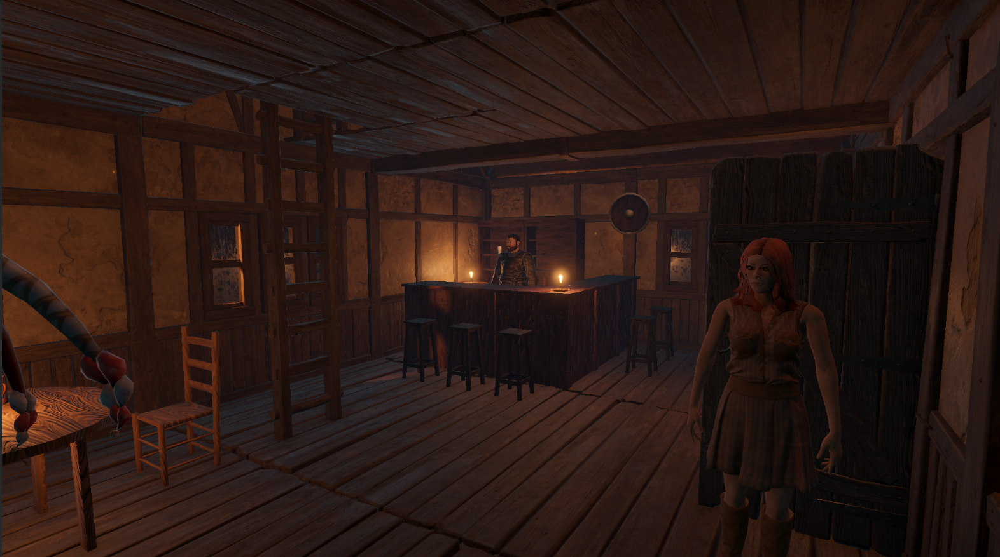
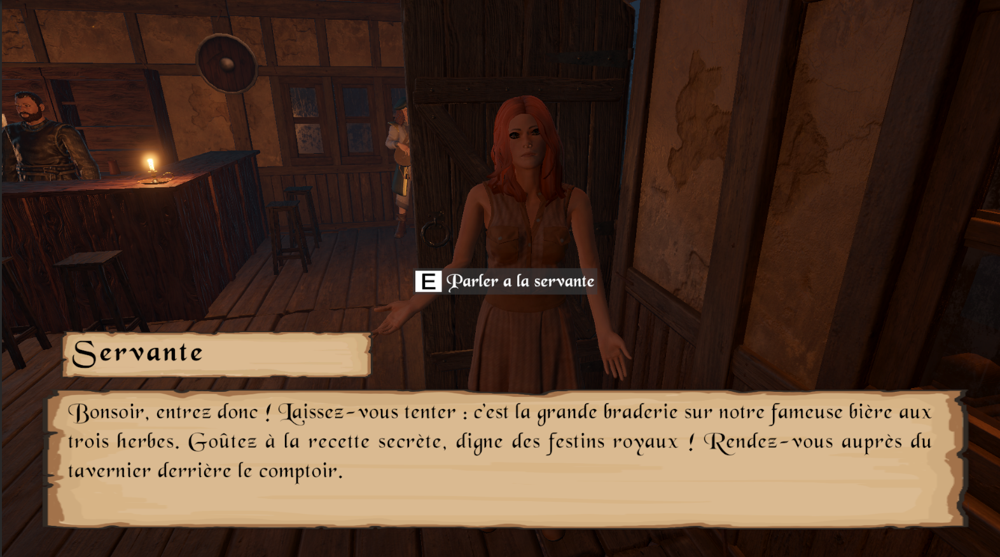
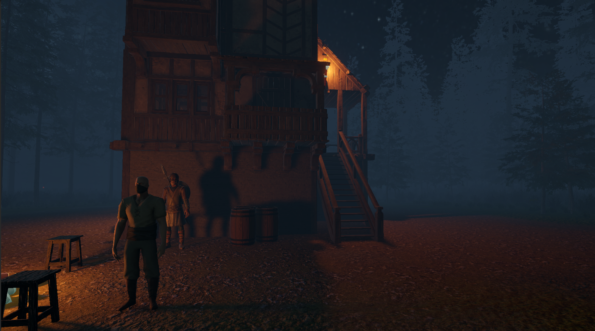

# 🎮 ProjetRVA

## 📌 Présentation

**ProjetRVA** est un jeu vidéo développé avec **Unity**.
Ce projet a été mené à bien dans le cadre du cours de Réalité Virtuelle et Augmentée.
L'objectif de ce projet est de créer un jeu vidéo immersif et interactif avec l'utilisateur.

Ce projet met en avant des compétences en **développement gameplay, conception de jeux et programmation en C#**.

---

## 🚀 Fonctionnalités principales

- Gameplay interactif : Interaction avec personnages non joueurs, avec objets, quêtes principales et secondaires, doublages.
- Intégration de shaders et d'effets visuels.
- Gestion des entrées utilisateurs et des interactions.

---

## 🧰 Technologies utilisées

- **Moteur** : Unity 
- **Langage** : C#
- **IDE** : Visual Studio Code

---

## 🎯 Défis techniques

- Développement d’un gameplay immersif et intéractif en C#  
- Intégration de shaders temps réel pour améliorer l’ambiance visuelle   
- Gestion d’un projet collaboratif avec GitHub

## 📷 Aperçu

